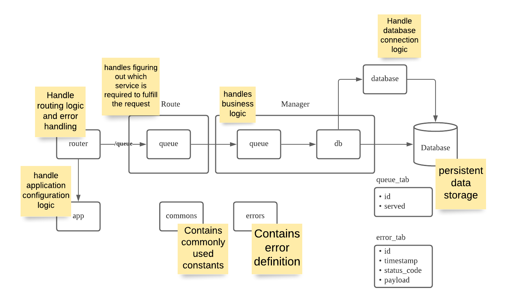

# ST0507 ADES AY21/22 Sem 1 CA1 Bare Backend

## Setup

1. Install [Node Js](https://nodejs.org/en/download/) if you have not done so.
    1. Alternative Installation via [Chocolatey](https://chocolatey.org/packages/nodejs-lts)
    2. Check if you have installed node previously by running `node --version`
        1. You should see the version number (e.g. `v14.15.0`)
2. Install [Docker](https://docs.docker.com/get-docker/) if you have not done so.
    1. Check if you have installed Docker previously by running `docker -v`
        1. You should see the version number (e.g. `Docker version 20.10.2, build 2291f61`)
3. Install [VS Code](https://code.visualstudio.com/download) if you have not done so previously.
4. Install the following VS Code Plugins
    1. [Better Comments](https://marketplace.visualstudio.com/items?itemName=aaron-bond.better-comments)
    2. [Docker](https://marketplace.visualstudio.com/items?itemName=ms-azuretools.vscode-docker)
    3. [Git Graph](https://marketplace.visualstudio.com/items?itemName=mhutchie.git-graph)
    4. [REST Client](https://marketplace.visualstudio.com/items?itemName=humao.rest-client)
5. Clone the repository ([How to clone a repository](https://docs.github.com/en/github/creating-cloning-and-archiving-repositories/cloning-a-repository))
6. Open a terminal at the folder path
7. Run `npm install`
8. Create a new file in the root directory `.env` (Note the dot at the front) and paste the following values into the file:

    ```
    DB_HOST=localhost
    DB_PORT=5432
    DB_USER=user
    DB_PASSWORD=password
    DB_DATABASE=virtual_queue
    DB_TEST_PORT=6543
    ```



## Instructions

1.  First thing you would want to do is to run

    ```
    npm init
    ```

2.  Following the above diagram, we are going to start with components that do not have any arrows pointing towards them. Thus we will start with the actual `database`
3.  If you open up `docker-compose.yml`, you may see the following line:

    ```
    ./database/init.sql:/docker-entrypoint-initdb.d/init.sql
    ```

    This line tells docker to put the file `./database/init.sql` into the container at the directory `/docker-entrypoint-initdb.d/` with the file name `init.sql`.

    This happens to be the sql file that the image will execute during initialization of the database. Thus we will add our `CREATE TABLE` script inside that file.

4.  Create a new folder named `database` and inside the folder, create a new file `init.sql`
5.  Looking at the diagram, we are expecting to support 2 table, `queue_tab` and `error_tab`, we will create `queue_tab` first and worry about `error_tab` later. Put the following code into `init.sql`

    ```sql
    CREATE TABLE queue_tab (
        id SERIAL primary key,
        served BOOLEAN not null default false
    );
    ```

6.  If you followed the setup instructions you should have created a `.env` file in the root directory with the following values:

    ```
    DB_HOST=localhost
    DB_PORT=5432
    DB_USER=user
    DB_PASSWORD=password
    DB_DATABASE=virtual_queue
    DB_TEST_PORT=6543
    ```

7.  Run the following command to start up the database:

    ```
    docker-compose up
    ```

    You should observe that there are 4 `CREATE` (2 in `db` and 2 in `db-test`). And it ends with `database is ready to accept connections`

8.  We have setup the actual `database`, we will now write javascript to establish connection with the `database` in a file named `database.js`
9.  In the `database` folder, create a new file `database.js`.
10. We will be using [`node-postgres`](https://node-postgres.com/) as the interface between our application and the database. Install it by running the following command:
    ```
    npm install pg
    ```
11. Going to the [`connecting` page](https://node-postgres.com/features/connecting) of the node-postgres API. It suggests that we can use either `Pool` or `Client` to establish connection with the database.

    > -   Client: a single connection with the database
    > -   Pool: a set of Clients being reused over and over again

    In our application, we will be using a `Pool`.

12. Reading the documentation on `connecting` further, it mentions that `pg` have 2 option for specifying the database's information to establish connection
    1. from environment variable OR
    2. programmatically. (We will do this).
13. Since these values are constants (unchanging throughout the app's lifecycle), let us create them in a `commons` file. Create a file `commons.js` in the root directory and enter the following values:

    ```js
    module.exports.DB_CONFIG = {
        host: process.env.DB_HOST,
        port: process.env.DB_PORT,
        user: process.env.DB_USER,
        password: process.env.DB_PASSWORD,
        database: process.env.DB_DATABASE,
        max: process.env.DB_MAX_POOL_SIZE || 20,
    };
    ```

14. Note that we are still referencing data from the environment, thus we need to load the values in the `.env` file into the environment. We will use the `dotenv` npm package to assist us with loading environment variable.

    Install the `dotenv` npm package

    ```
    npm install dotenv
    ```

    At the top of the `commons.js` file add the following line:

    ```js
    require('dotenv').config();
    ```

15. We will now be able to create the connections. Create a new file `database.js` in the `database` folder and include the following lines:

    ```js
    const { Pool } = require('pg');
    const { DB_CONFIG } = require('../commons');

    let pool;
    module.exports.getPool = function () {
        if (!pool) pool = new Pool(DB_CONFIG);
        return pool;
    };
    ```

    > Can you see that `new Pool()` is called only once regardless of how many times `getPool()` is invoked?

16. We can test our file by running this file in our terminal, open a terminal and run the following commands:

    ```
    node
    ```

    To start a new Node terminal, and then:

    ```js
    const { getPool } = require('./database/database.js');
    const pool = getPool();
    pool.query('select * from queue_tab;')
        .then(function (result) {
            console.log(result.rows);
        })
        .catch(console.error);
    ```

    You should observe an empty array as there are no rows in the table yet.

17. Now that we are able to establish connection with the actual database, we can now prepare the `db_manager` to provide us with some methods to interact with the database. Create a new directory `managers` and inside, create a file `db_manager.js` with the following lines:

        ```js
        const { getPool } = require('../database/database');

        const pool = getPool();
        ```

18. Recall that one of the basic feature of this backend is to allow enqueueing and dequeueing. We will start with enqueueing, enter the following lines into `db_manager.js`

    ```js
    module.exports.enqueue = function () {
        return pool
            .query(
                `INSERT INTO queue_tab (id, served) 
                VALUES (DEFAULT, DEFAULT ) 
                RETURNING *`,
            )
            .then((result) => result.rows[0].id);
    };
    ```

    > Can you explain what is happening in this method?
    >
    > -   What is the return value of the method?
    > -   What does the resolved value represent?

19. Next for dequeue;

    ```js
    return pool
        .query(
            `UPDATE queue_tab 
            SET 
                served = true
            WHERE id = (
                SELECT id FROM queue_tab 
                WHERE not served ORDER BY id LIMIT 1
            ) 
            RETURNING *`,
        )
        .then((result) => (!result.rows.length ? 0 : result.rows[0].id));
    ```

20. We can once again test that the file has been set up correctly by running it on a Node terminal.

    ```
    node
    ```

    > Because we have made changes to our file, we need to restart the Node terminal, if your previous Node terminal is still active use Ctrl+C to close the session and then start a new one again.

    To start a Node terminal, and then the following setup:

    ```js
    const { getPool } = require('./database/database.js');
    const dbManager = require('./managers/db_manager');

    const pool = getPool();
    ```

21. We want to try enqueueing a few entities and check the number of rows in the database afterwards, (i.e. calling enqueueing 3 times should later show that there are 3 rows.)

    ```js
    dbManager
        .enqueue()
        .then(function (queueId) {
            console.log(`First enqueue: ${queueId}`);
            return dbManager.enqueue();
        })
        .then(function (queueId) {
            console.log(`Second enqueue: ${queueId}`);
            return dbManager.enqueue();
        })
        .then(function (queueId) {
            console.log(`Third enqueue: ${queueId}`);
            return pool.query('select * from queue_tab');
        })
        .then(function (result) {
            console.log(`Should see 3 rows, Number of rows: ${result.rows.length}`);
        });
    ```

    You should see the following output:

    ```
    First enqueue: 1
    Second enqueue: 2
    Third enqueue: 3
    Should see 3 rows, Number of rows: 3
    ```

22. We can also simply print out all the rows to check that they are all not served

    ```js
    pool.query('select * from queue_tab').then(function (result) {
        console.log(result.rows);
    });
    ```

    You should see the following output:

    ```json
    [
        { "id": 1, "served": false }
        { "id": 2, "served": false }
        { "id": 3, "served": false }
    ]
    ```

23. We can next test the `dequeue` function. (i.e. calling dequeue 2 times should serve entity 1 and 2).

    ```js
    dbManager
        .dequeue()
        .then(function (queueId) {
            console.log(`First served ${queueId}`);
            return dbManager.dequeue();
        })
        .then(function (queueId) {
            console.log(`Second served ${queueId}`);
            return pool.query(`select * from queue_tab`);
        })
        .then(function (response) {
            console.log(response);
        });
    ```

    You should observe the following:

    ```
    First served 1
    Second served 2
    [
        { "id": 1, "served": false }
        { "id": 2, "served": false }
        { "id": 3, "served": false }
    ]
    ```

24. We can be confident of the `dequeue` method only after we have tested all of it's expected behavior. Specifically, what happens when we try to dequeue an empty queue? Do we get an error? Do we get a number? Try running a script in the Node terminal to test the behavior.
25. Now that our `db_manager` is ready, we can start to prepare our `queue_manager`. Create a new file `queue_manager.js` with the following lines:

    ```js
    const dbManager = require('./db_manager');

    module.exports.enqueue = function () {
        return dbManager.enqueue().then((customerId) => ({ customer_id: customerId }));
    };
    ```

26. Following the example of `enqueue`, you should be able to implement `dequeue` as well.
27. The `queue_manager` is simple enough, write some scripts to ensure that the `enqueue` and `dequeue` of the `queue_manager` is working as expected.
28. We will now prepare the `app.js` and `router.js`. Firstly, create a new file `app.js` and include the following lines:

    ```js
    const express = require('express');
    const http = require('http');

    const app = express();
    const server = http.Server(app);

    module.exports = { app, server };
    ```

29. Now create a new file `router.js` and add the following lines:

    ```js
    const cors = require('cors');
    const { app } = require('./app');
    ```

    These are the modules we require to build the application.

30. Let us first create a middleware to allow us to perform some testing. Enter the following lines:

    ```js
    app.get('/', function (req, res, next) {
        return {
            message: 'Welcome to our queue system, the following are the supported APIs',
            apis: [
                {
                    name: 'Enqueue',
                    endpoint: '/queue',
                    method: 'POST',
                },
                {
                    name: 'Dequeue',
                    endpoint: '/queue',
                    method: 'delete',
                },
            ],
        };
    });
    ```

31. Create a new file `www` this is the file we will execute to start our server, inside the file include the following lines:

    ```js
    const commons = require('./commons');
    const { app } = require('./app');

    const port = process.env.PORT || 3000;
    app.listen(port, function () {
        console.log(`App listening to port ${port}`);
    });
    ```

32. In order to test the middleware we created, we will start the server and send some HTTP request. Start the server by running the following command:

    ```
    node ./www
    ```

33. If you followed the setup instructions, you should have installed the [REST Client](https://marketplace.visualstudio.com/items?itemName=humao.rest-client) plugin.
34. Create a new folder `test` and inside create another folder `http`. Inside the `http` folder, create a new file `enqueue-dequeue.test.http` with the following lines:

    ```http
    @host = http://localhost:3000

    ### Test

    GET {{host}} HTTP/1.1
    ```

35. You should see a `send request` on top of `POST ...`, click on it to send a HTTP request to our server.

    You should then see a success response with the JSON we specified earlier.

36. Now we know that are app is functional, it is time to prepare the routes to hook our business logic to the app.
37. Create a new directory `routes` and inside the folder, create a new file `queue-route.js` with the following lines:

    ```js
    const express = require('express');
    const queueManager = require('../managers/queue_manager');

    const router = express.Router();
    router.post('/', (req, res, next) =>
        queueManager
            .enqueue()
            .then((response) => res.status(201).json(response))
            .catch(next),
    );

    module.exports = router;
    ```

    > Which API is this for? enqueue? or dequeue?

38. Following the above example, create another middleware for the other API. (Hint: What's the Request Method? Which method do we call? How about the response status?)
39. Back in `routes.js` add the following lines:

    ```js
    // near the top of the file
    const queueRoute = require('./routes/queue_route');

    // after the first middleware
    app.use('/queue', queueRoute);
    ```

40. Time to test our application, open up `enqueue-dequeue.test.http` once again and add the following request:

    ```
    ### Enqueue

    POST {{host}}/queue HTTP/1.1
    ```

41. Send the Enqueue request, using Node terminal, verify that a new row has indeed been added. Repeat this 2 steps again if you need to do a proper verification.
42. Add another request in `enqueue-dequeue.test.http` for dequeue. Run it and check it in the Node Environment.
43. We have successfully implemented & tested the happy flow of `enqueue` and `dequeue`.
44. What happens if we send a request that is not defined within our app? For example:

    ```
    ### Not Found

    GET {{host}}/afjsdlfjsdl HTTP/1.1
    ```

    We will now write some error handling mechanism.

45. Let's first create another file `errors.js` to store our error definitions. In the file, add the following lines:

    ```js
    /* eslint-disable max-classes-per-file */

    module.exports.ERROR_CODE = {
        URL_NOT_FOUND: 'URL_NOT_FOUND',
    };

    module.exports.UrlNotFoundError = class UrlNotFoundError extends Error {};
    ```

46. Return to `routes.js` and import the 2 error definition near the top of the file we just created:

    ```js
    // near the top of the file
    const { ERROR_CODE, ...errors } = require('./errors');
    ```

47. Still in `routes.js` add the following lines at the bottom of the file. (Try it: What happen if you add it before the first middleware?)

    ```js
    // 404
    app.use((req, res, next) => next(new errors.UrlNotFoundError(`${req.method} ${req.originalUrl} Not Found`)));

    // error handler
    // eslint-disable-next-line no-unused-vars
    app.use((error, req, res, next) => {
        // Console.error for quick debugging using console
        console.error(error); // eslint-disable-line no-console

        // Extract information
        let status = 500;
        let code = ERROR_CODE.UNEXPECTED_ERROR;
        let message = 'Unexpected Error!';
        const reason = error.message;

        // Special case of errors
        if (error instanceof errors.UrlNotFoundError) {
            status = 404;
            code = ERROR_CODE.URL_NOT_FOUND;
            message = `Resource not found`;
        }

        const payload = { code, error: message, reason };

        // Log and respond accordingly.
        return res.status(status).json(payload);
    });
    ```

48. Now run the request to trigger a 404 again. Observe the difference.
49. And that's it, you now have a minimally working backend to support enqueue and dequeue.
